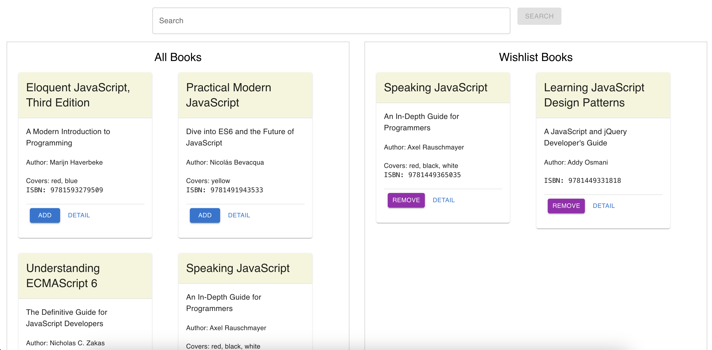

# Books Libary
This is a React application that allows to search books and add them to list.

## 🌍 Environment Details
- **React**: 18.2.0
- **Node**: v18.18.2
- **NPM**: 10.2.1

## 🚀 Setup Guide
1. `npm install`
2. `npm start`

## Features

1. **Search:**
By default all the books will be available. You can search based on book title, subtitle, author or ISBN.

2. **Add to Wishlist:**
From the search result you can add any book to the wishlist. You can't add same book twice.

    

3. **Remove from Wishlist:**
You can remove any book from the wishlist.

4. **Demo**

[Watch Demo Video](./book-app/src/assets/demo.mov)
